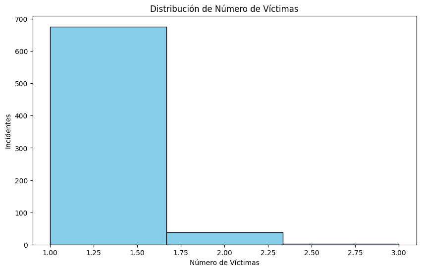
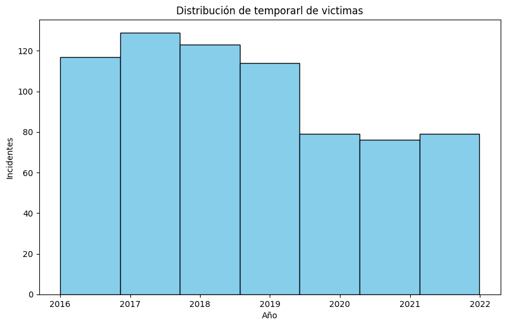
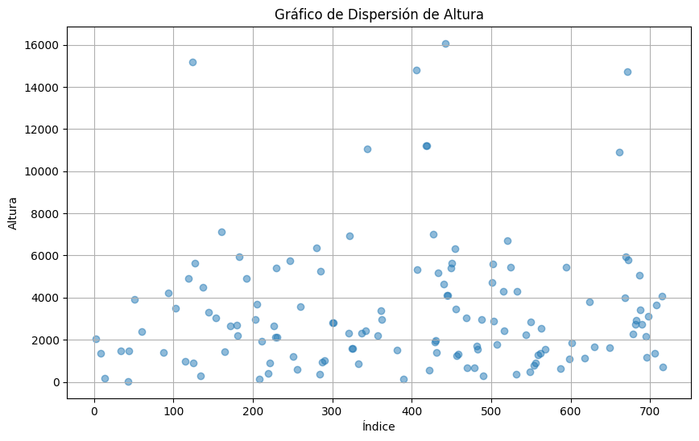
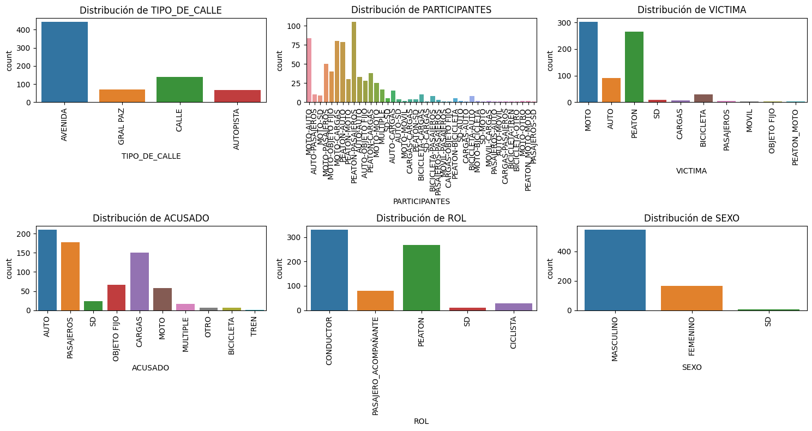

# Informe Exploratorio de Datos (EDA) de Siniestros Viales

Por Abraham Gómez

## Introducción
En este informe, contiene un análisis exploratorio de datos (EDA) para comprender mejor el los datos relacionados a siniestros viales de la Ciudad Autonoma de Buenos Aires (CABA) y de ellos extraer información relevante.

## Objetivos del EDA
- Explorar y comprender la estructura general del conjunto de datos.
- Identificar características clave y distribuciones de variables.
- Detectar valores atípicos (outliers) y manejarlos si es necesario.
- Realizar visualizaciones para resaltar patrones y relaciones.

## Carga de Datos

Los datos utilizados en este analisis fueron proporcionados por el Observatorio de Movilidad y Seguridad Vial disponible en el enlace:

https://data.buenosaires.gob.ar/dataset/victimas-siniestros-viales

Inicialmente se carga el conjunto de datos contenidos en el libro `homicidios.xlsx` el cual contiene dos hojas principales con nombre `HECHOS` y `VICTIMAS` ademas de algunos diccionarios que nos brindan información adicional sobre los datos.

```python
# Cargar el conjunto de datos
import pandas as pd
hechos = pd.read_excel('../dataset/homicidios.xlsx', sheet_name='HECHOS')
victimas = pd.read_excel('../dataset/homicidios.xlsx', sheet_name='VICTIMAS')
```
Podemos visualizar en el dataframe `hechos` que contiene toda la información relacionada con los incidentes ocurridos en la Ciudad Autonoma de Buenos Aires (CABA) comprendida entre el 1 de enero del 2016 a 30 de diciembre del 2021. Entre la informació más relevante tenemos; Fecha, hora, número de victimas, lugar, posicion geografica (Latitud, Longitud), vehiculos participantes, vehiculo victima, vehiculo acusado e ID identificador único.

En el dataframe `victima` podemos destacar como información principal fecha del incidente, vehiculo victima, rol del lesionado, sexo, edad y fecha de deceso, ademas de un ID identificador único que concuerda con el dataframe `hechos`.

Se optó por combinar ambos dataframes haciendo uso del identificador único de cada uno de ellos, ademas de limpiar y eliminar columnas repetidas para facilitar el analisis obteniendo un dataframe llamado `df`.

## Resumen Estadístico
En esta sección se generan estadísticas descriptivas para las variables numéricas y categóricas.

El dataframe resultante contiene las siguientes variables:

| No. | Variable | Descripción |
|---|----------|-------------|
| 1 | ID | Identificador unico de siniestro|
| 2 | N_VICTIMAS | Número de victimas |
| 3 | FECHA | Fecha de siniestro |
| 4 | AAAA | Año de siniestro |
| 5 | MM | Mes del siniestro |
| 6 | DD | Día del mes del siniestro |
| 7 | HORA | Hora del siniestro en formato HH:MM:SS |
| 8 | HH | Hora del siniestro en formarto 24 horas |
| 9 | LUGAR_DEL_HECHO | Entrecalles del lugar del incidente |
| 10 | TIPO_DE_CALLE | Categoria de la calle en donde ocurrieron los hechos |
| 11 | Calle | Calle en donde ocurrio el incidente |
| 12 | Altura | Distancia en donde ocurrieron los hechos | 
| 13 | Cruce | Cruce con otras vialidades |
| 14 | Dirección Normalizada | Direccion en formato USIG |
| 15 | COMUNA | Comuna categorizada en números enteros del 0 al 15 |
| 16 | XY (CABA) | Geocodificación plana | 
| 17 | pos x | Longitud geográfica |
| 18 | pos y | Latitud geográfica |
| 19 | PARTICIPANTES | Victima(s) y acusado |
| 20 | VICTIMA | Categoria del vehiculo victima |
| 21 | ACUSADO | Categoria del vehiculo acusado |
| 22 | ROL | Rol que desempeña la victima en el vehiculo victima |
| 23 | SEXO | Sexo de la victima |
| 24 | EDAD | Edad de la victima |
| 25 | FECHA_FALLECIMIENTO | Fecha del deceso de la victima (si aplica) |
| 26 | Coordenadas | Cordenadas conformato Latitud, Longitud |

# Estadísticas descriptivas para variables numéricas
- `N_VICTIMAS`
Esta variable presenta como valores posibles entre 1 y 3 siendo el más frecuente el numero 1 lo cual demuestra que estan los datos cargados hacia el 1.


- FECHA
Los incidentes registrados estan entre los años 2016 a 2021 en donde podemos encontrar que el número de accidentes anuales han disminuido a partir del año 2019 como puede apreciarse en la figura 2.


- `Altura`

Esta variable presenta una gran cantidad de valores faltantes (584 registros nulos) lo que representa un total del 81.5 % de los datos del la variable, ademas de lo anterior el valor mínimo es 30 y el máximo es 16080, lo cual demuestra un rango muy amplio de valores, es posible que la unidad utilizada en esta variable sean metros.

La figura 3 muestra la dispersión de los datos para la variable Altura, en donde podemos encontrar ciertos valores atipicos.

En conclusión, esta variable no es de buena calidad ya que presenta una gran cantidad de registros faltates asi como valores atipicos, ademas de lo anterior podemos encontrar que la desviación estándar es muy grade 3095.161836 lo que muestra la gran variabilidad.

- Latitud y Longitud
Las variables `pos x` y `pos y`, representan la Longitud y la Latitud respectivamente, en ellas podemos encontrar que se tienen unicamente 13 registros faltantes, los valores medios de latitud y longitud son -58.441664	y -34.619700 respectivamente lo cual nos lleva a las coordenadas (-34.619700,-58.441664) la cual corresponde a la ciudad analizada en este reporte como se puede corroborar en la imagen adjunta obtenida en Google Maps.

Puede consultar la ubicación directamente en el siguiente enlace:
https://maps.app.goo.gl/nQCPZ78Tdv3xciSEA

- `EDAD`
La variable `EDAD` presenta un rango de datos entre 1 y 95 años, en donde en promedio las victimas presentaban una edad de 42 años con una desviación estandár de alrededor de 20 años, a pesar de que se intentan identificar outliers en esta variable y se encuentra que esta variable es consistente incluso si retiramos datos atipicos.
La distribución de esta variable esta cargada en el los primeros 2 cuartiles, lo que muestra que la mayoria de accidentes reportados fue entre los 20 a los 40 años.


# Estadísticas descriptivas para variables categóricas
El tipo de vialidad categorizada en `TIPO_DE_CALLE`muestra que la mayoria de los eventos registrados fueron en avenidas, lo cual tiene sentido por la forma en la que se encuentran las arterias viales de CABA.

Los `PARTICIPANTES` en los incidentes que fueron registrados más frecuentemente son los peatones o pasajeros, mientras que la variable `VICTIMA` que fue registrada más frecuentes fueron las Motocicletas y los peatones lo cual muestra el gran riesgo que corren estos individuos

El vehiculo mas frecuentemente categorizado como `ACUSADO`fueron los Autos, Pasajeros, y vehiculos de carga, mientras que el `ROL` que jugo la victima fue Conductor, Peaton y pasajero. Por otro lado `SEXO` de la victima fue mayormente marculino



## Conclusiones
Los datos presentados por Observatorio de Movilidad y Seguridad Vial muestran tener una buena calidad, salvo por la variable `Altura` en donde se encontró una gran cantidad de faltantes, asi como valores atipicos, por otro lado las variables categóricas sugieren que una buen cantidad de accidentes tuvieron que ver con peatones, es posible que se puedan reducir accidentes si se toman medidas con los peatones, mientras que otro grupo de vehiculos vulnerable son las motocicletas las cuales presentan una gran cantidad de incidentes, y el grupo de edades más vulnerable son los hombres entre 20 y 40 años. En el Dashboard que se presentara en la siguiente version de este reporte se validarán estas afirmaciones.
